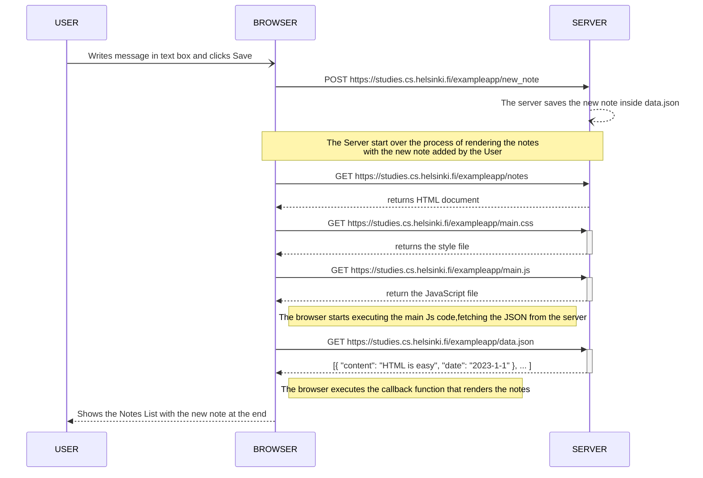

```mermaid
sequenceDiagram
    participant user as USER
    participant browser as BROWSER
    participant server as SERVER

    user-)browser: Writes message in text box and clicks Save
    browser->>server: POST https://studies.cs.helsinki.fi/exampleapp/new_note
    server--)server: The server saves the new note inside data.json

    Note over browser, server: The Server start over the process of rendering the notes <br> with the new note added by the User

    browser->>server: GET https://studies.cs.helsinki.fi/exampleapp/notes
    server-->>browser: returns HTML document

    browser->>+server: GET https://studies.cs.helsinki.fi/exampleapp/main.css
    server-->>-browser: returns the style file

    browser->>+server: GET https://studies.cs.helsinki.fi/exampleapp/main.js
    server-->>-browser: return the JavaScript file

    Note right of browser: The browser starts executing the main Js code,fetching the JSON from the server

    browser->>+server: GET https://studies.cs.helsinki.fi/exampleapp/data.json
    server-->>-browser: [{ "content": "HTML is easy", "date": "2023-1-1" }, ... ]

    Note right of browser: The browser executes the callback function that renders the notes

    browser-->>user: Shows the Notes List with the new note at the end
```
