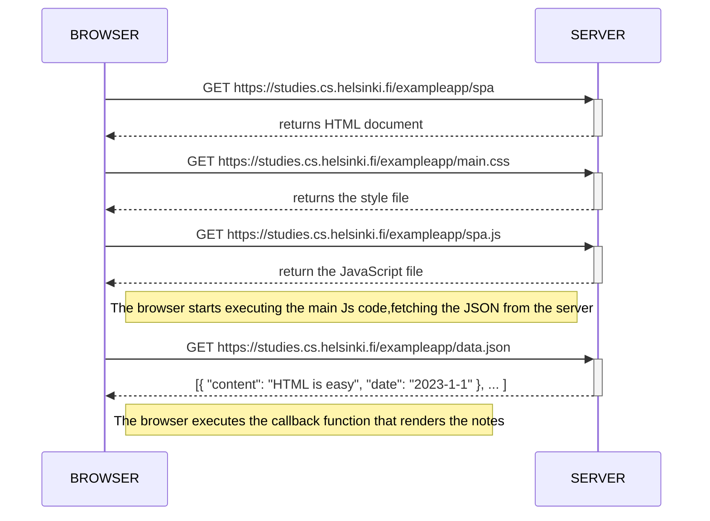

```mermaid
sequenceDiagram
    participant browser as BROWSER
    participant server as SERVER

    browser->>+server: GET https://studies.cs.helsinki.fi/exampleapp/spa
    server-->>-browser: returns HTML document

    browser->>+server: GET https://studies.cs.helsinki.fi/exampleapp/main.css
    server-->>-browser: returns the style file

    browser->>+server: GET https://studies.cs.helsinki.fi/exampleapp/spa.js
    server-->>-browser: return the JavaScript file

    Note right of browser: The browser starts executing the main Js code,fetching the JSON from the server

    browser->>+server: GET https://studies.cs.helsinki.fi/exampleapp/data.json
    server-->>-browser: [{ "content": "HTML is easy", "date": "2023-1-1" }, ... ]

    Note right of browser: The browser executes the callback function that renders the notes
```
